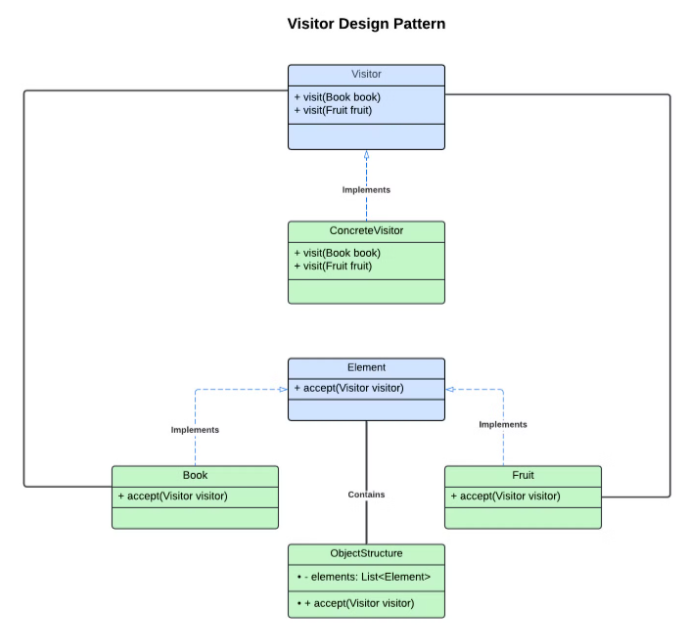

# Visitor Pattern

## Type
**Behavioral Design Pattern**

## Introduction
The Visitor pattern is a behavioral design pattern that allows you to define new operations on objects without changing the classes on which it operates. It separates the algorithm from the objects it works on by letting you place these new operations in a visitor object, which means that existing object structures can remain unchanged.

## Video Resources
- [Visitor Pattern Explained - Gui Ferreira](https://www.youtube.com/watch?v=yyKrt7zSmv0&ab_channel=GuiFerreira) (10 minutes)
- [Visitor Pattern - git-amend](https://www.youtube.com/watch?v=Q2gQs6gIzCM&ab_channel=git-amend) (10 minutes)

## Rationale
The main rationale behind the Visitor pattern is to allow for the extension of an object’s behavior without modifying the object itself. This is particularly useful when the object structure is stable, but new functionality needs to be added frequently. Instead of adding many new methods to these objects, which can clutter the class design, the Visitor pattern centralizes the logic in a separate visitor class. This keeps the object model clean and adheres to the open/closed principle, where objects are open for extension but closed for modification.

## UML Diagram
This diagram demonstrates how the Visitor Design Pattern works by separating the behavior (operations) from the objects themselves. It allows you to define new operations on a set of elements without modifying the elements' classes. Instead, you introduce new visitors that contain the behavior.

### Components:

- **Visitor Interface**:
    - Declares methods: `visit(Book book)` and `visit(Fruit fruit)`.
    - Defines abstract actions on different element types without modifying their structure.

- **ConcreteVisitor**:
    - Implements `visit(Book book)` and `visit(Fruit fruit)` from the Visitor interface.
    - Contains the actual operations performed on `Book` and `Fruit` objects.

- **Element Interface**:
    - Defines the `accept(Visitor visitor)` method.
    - Allows elements to accept a visitor and enable double-dispatch.

- **Concrete Elements (Book and Fruit)**:
    - Implement the `accept(Visitor visitor)` method.
    - When `accept()` is called, the appropriate `visit` method is invoked on the visitor.

- **ObjectStructure Class**:
    - Manages a collection of elements (`List<Element>`).
    - Iterates over elements and applies the visitor using the `accept()` method.

## Simple Code Example Output (simple.cs)
```Dog says: Woof!```
```Cat says: Meow!```

## Common Usage in the Software Industry
- **Stable Structures with New Operations**: The Visitor pattern is used when object structures remain stable, but new functionality needs to be added over time.
- **Compilers**: Nodes in a syntax tree are visited for operations like code generation and optimization.
- **Document Processing Systems**: Used to apply operations like exporting to different formats (e.g., PDF, DOCX).

## Main Code (main.cs) Output
```Book price: 27.0 (10% discount)```
```Fruit price: 14.25 (5% discount)```


